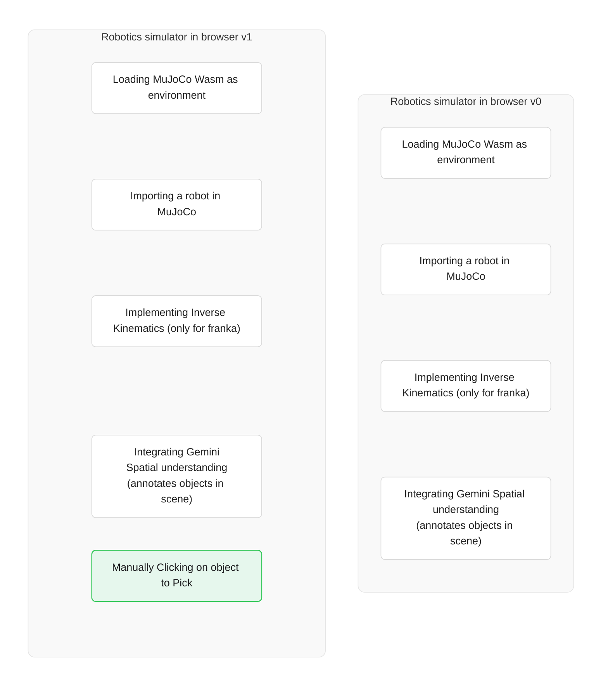

# Robotics Simulator in Browser (Franka Panda)

A web-based robotics simulator running directly in the browser using MuJoCo physics compiled to WebAssembly (WASM), Three.js rendering, and multimodal spatial reasoning via Gemini and manual direct targeting ("Click to Pick").

## Architecture Evolution



`Robotics simulator in browser v0` is taken from [Xavier Plantaz from Google AI](https://dev.to/googleai/building-a-gemini-powered-robotics-simulator-in-the-browser-with-mujoco-wasm-hjj) 

## Getting Started

### Prerequisites
- Node.js (v18+)
- npm or pnpm

### Installation & Run Locally
1. Install dependencies:
```sh
npm install
# or pnpm install
```
2. Set the `GEMINI_API_KEY` in [.env.local](.env.local) to your Gemini API key

3. Run Backend in another terminal (leave that running)
```sh
cd server
uv sync
source .venv/bin/activate
python3 pyroki_server.py
```

4. Run the app (in another terminal tab):
   `npm run dev`/ `pnpm run dev` at the root of project.

### Run and deploy your AI Studio app

This contains everything you need to run your app locally.

View your app in AI Studio: https://ai.studio/apps/2dfef720-ed29-44b6-a6dc-7940694b09f5
